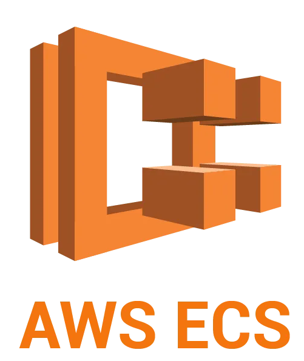
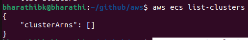
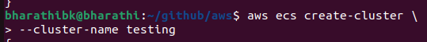
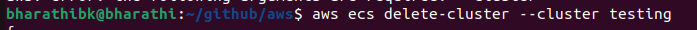

# Basic to advance aws ecs service

# AWS_ECS

## there are three importent topics in ecs

### 1. Cluster
### 2. Service (load balancer)
### 3. Tasks : is the one run our conatiner(step1)

## commands for aws ecs 

### List the cluster
#### aws ecs list-clusters

### Create a new cluster
#### aws ecs create-cluster \
            --cluster-name testing

### Delete the cluster
#### aws ecs delete-cluster -cluster cluser_name

### login to the ecr
#### aws ecr get-login-password --region ap-south-1 | docker login --username AWS --password-stdin 47472.dkr.ecr.ap-south-1.amazonaws.com