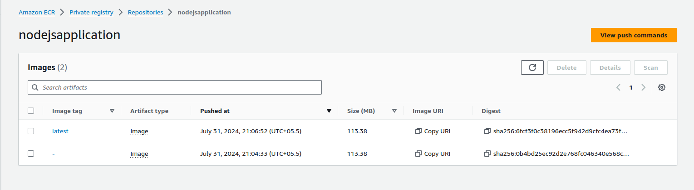
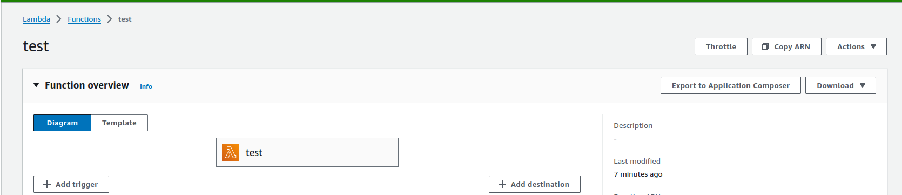
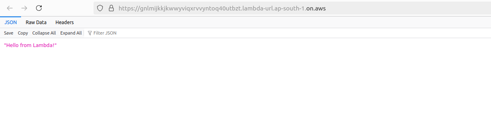

# Steps

## Create a ecr 

## Docker image Build 
#### Command:  docker build -t nodejsapplication:latest

## Login AWS CLI
#### command: aws configure

## Login AWS ecr
#### command: aws ecr get-login-password --region ap-south-1 | docker login --username AWS --password-stdin PASTE_THE_REPOSITORY_URL

## Tag the build docker image
#### command: docker tag nodejsapplication:latest PASTE_THE_REPOSITORY_URL

## Push the docker image to ECR
#### docker push reposiroty_url:latest

## Create a lambda function with docker image chosse the docker image from ecr latest image

## Enable the Lambda url 
