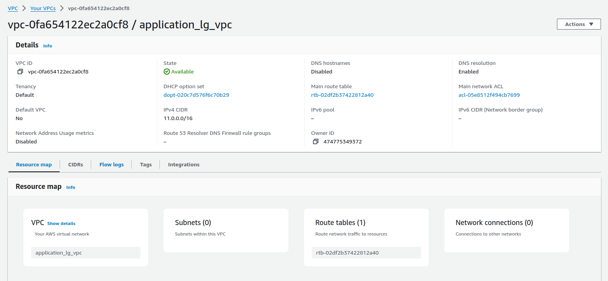
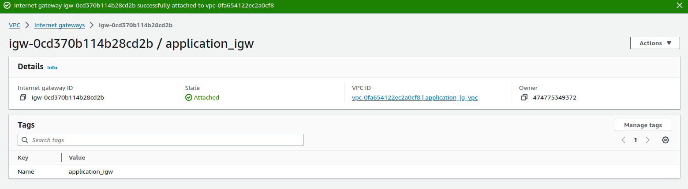
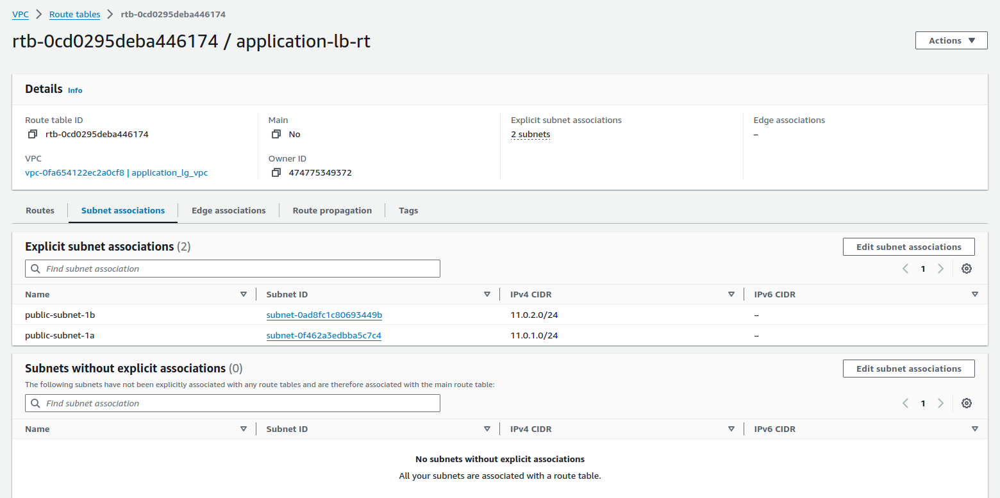
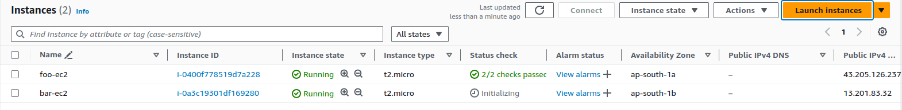
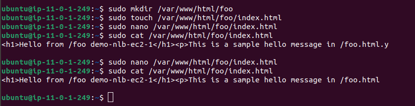
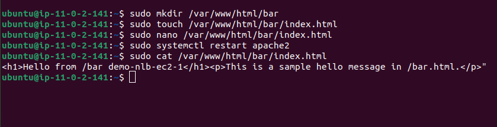
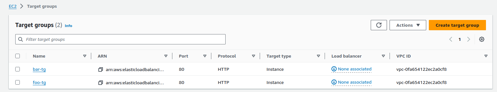
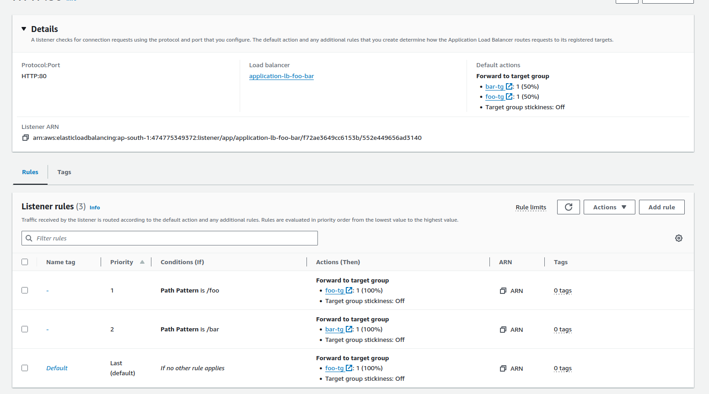
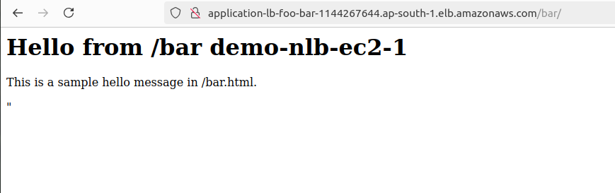

# Application Load Balancer

![Application Load Balancer Overview]


## Step 1 Create a VPC with CICR range 11.0.0.0/16


## Step 2 Create an IGW and attach igw to VPC


## Step 3 Create a 2 public subnet in diffrent availablity zone


## Step 4 Create a 2 ec2 in diffrent availablity zone while create an ec2 add bash script in user data

``` #!/bin/bash
yes | sudo apt update
yes | sudo apt install apache2
echo "<h1>Server Details</h1><p><strong>Hostname:</strong> $(hostname)</p><p><strong>IP Address:</strong> $(hostname -I | cut -d' ' -f1)</p>" > /var/www/html/index.html
sudo systemctl restart apache2 
```



## Step 5 using shh key to connect the both ec2 machine and perform below task

``` sudo mkdir /var/www/html/foo
sudo mkdir /var/www/html/bar

sudo touch /var/www/html/foo/index.html
sudo touch /var/www/html/bar/index.html

sudo vi /var/www/html/foo/index.html
<h1>Hello from /foo demo-nlb-ec2-1</h1><p>This is a sample hello message in /foo.html.
sudo vi /var/www/html/bar/index.html
<h1>Hello from /bar demo-nlb-ec2-1</h1><p>This is a sample hello message in /bar.html.</p>"

sudo systemctl restart apache2
```
### foo server :


### bar server :


## Step 6 Create a 2 target group one is for foo ec2 and another one is for bar ec2


## Step 7 Create a application load balancer and attach the target group


## Output 
## bar 


## foo
