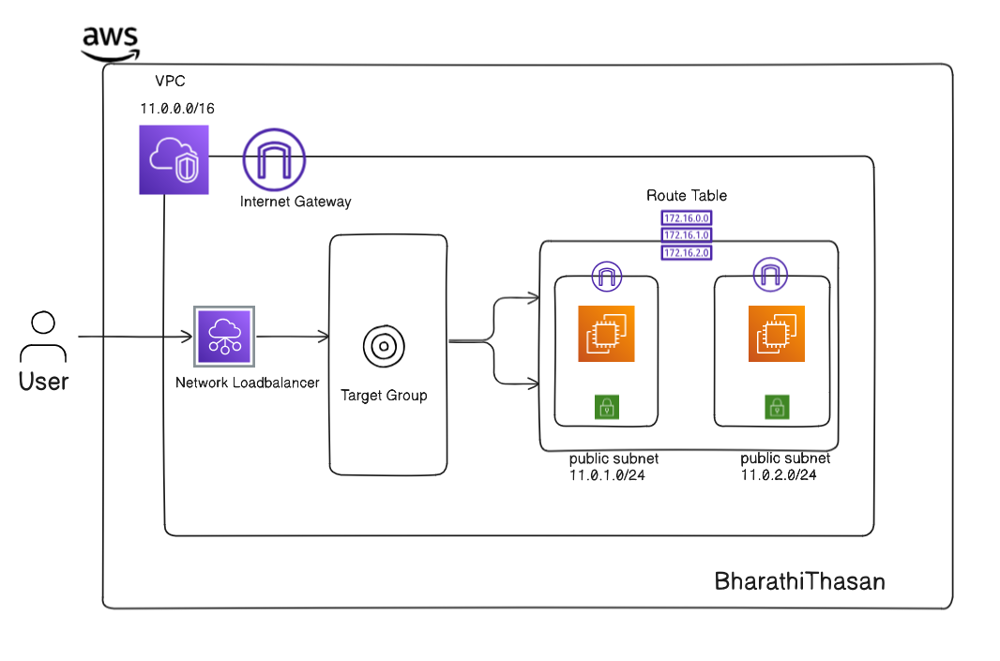
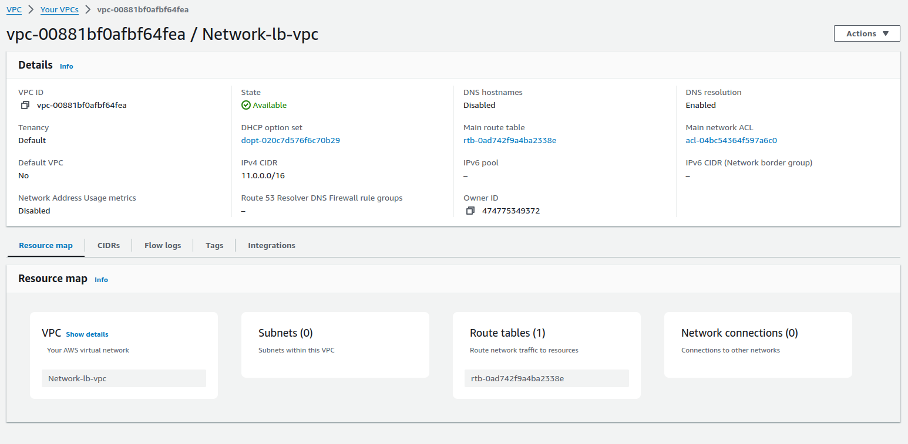
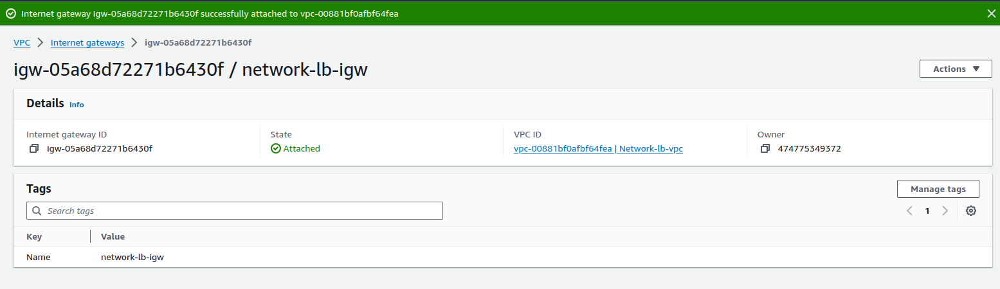
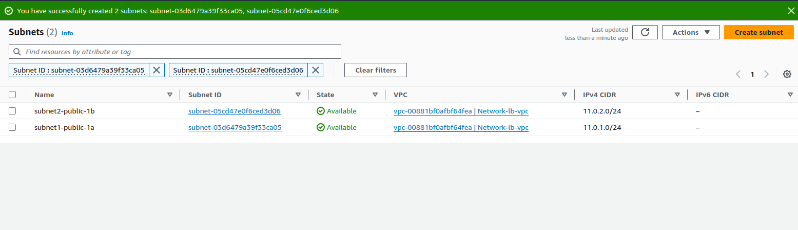
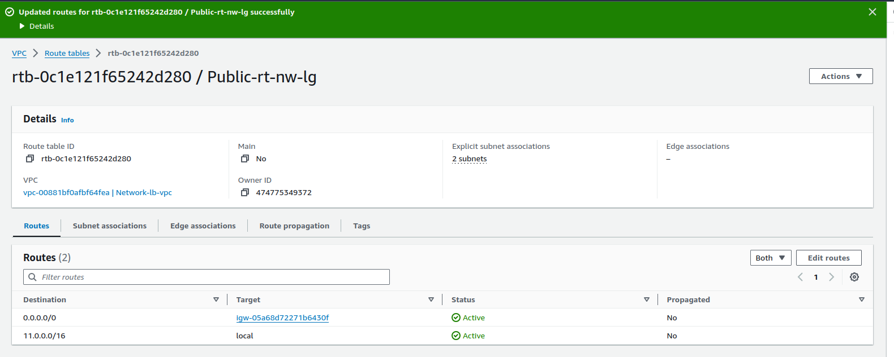
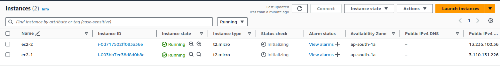
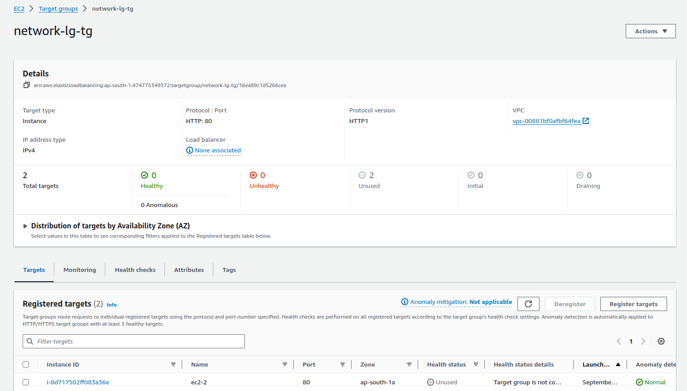
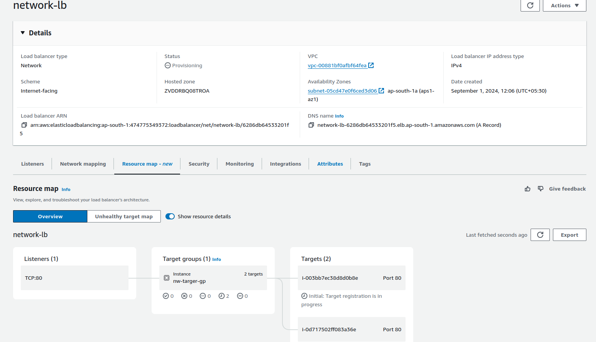
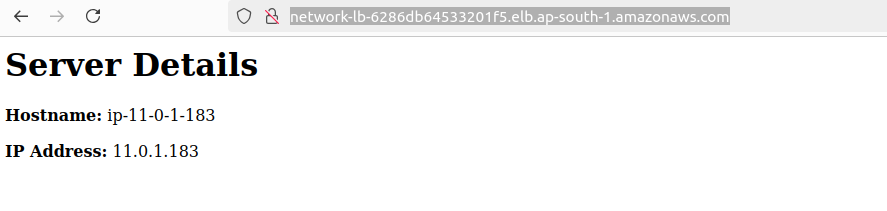

## Network loadbalancer





``` #!/bin/bash
yes | sudo apt update
yes | sudo apt install apache2
echo "<h1>Server Details</h1><p><strong>Hostname:</strong> $(hostname)</p><p><strong>IP Address:</strong> $(hostname -I | cut -d" " -f1)</p>" > /var/www/html/index.html
sudo systemctl restart apache2  ```


### Step 1 Create a VPC  CICR RANGE 11.0.0.0/24


### Step 2 Create a IGW(internet gateway) and attach to the VPC


### Step 3 Create a 2 public subnetgroup


### Step 4 Create a Routetable and attach the 2 pulic subnet and privide igw


### Step 5 Create a ec2-1 and ec2-2 with public subnet 1 and public subnet 2 which create the ec2 in user data add above bash script


### Step 6 Create a target group 


### Step 7 Create a network load balancer


### Final output 
#### Server 1


#### Server 2
