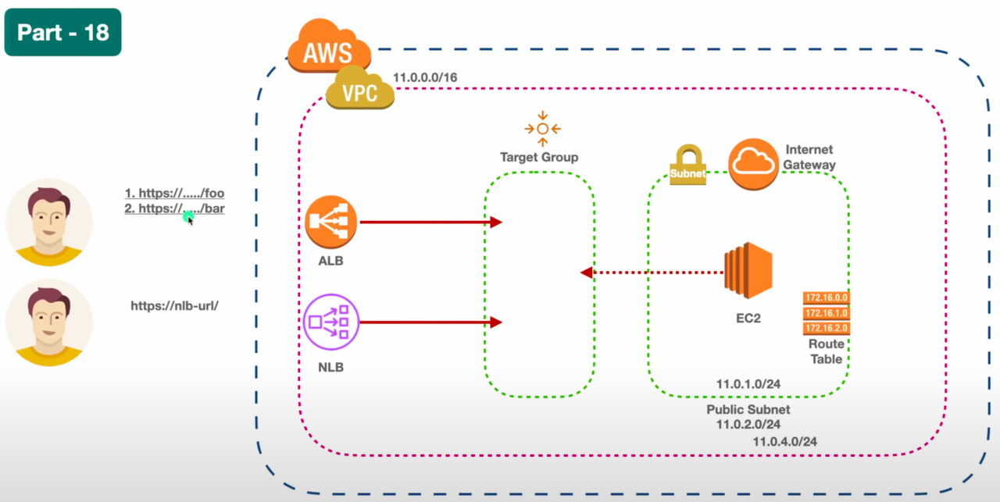

application load balancer today demo : https://www.youtube.com/watch?v=cuJTmBvFCS0


application vs network :    network load balancer : https://www.youtube.com/watch?v=_d8xGNKAqeo    

.

``` #!/bin/bash
yes | sudo apt update
yes | sudo apt install apache2
echo "<h1>Server Details</h1><p><strong>Hostname:</strong> $(hostname)</p><p><strong>IP Address:</strong> $(hostname -I | cut -d" " -f1)</p>" > /var/www/html/index.html
sudo systemctl restart apache2  ```


sudo mkdir /var/www/html/foo
sudo mkdir /var/www/html/bar

sudo touch /var/www/html/foo/index.html
sudo touch /var/www/html/bar/index.html

sudo vi /var/www/html/foo/index.html
<h1>Hello from /foo demo-nlb-ec2-1</h1><p>This is a sample hello message in /foo.html.
sudo vi /var/www/html/bar/index.html
<h1>Hello from /bar demo-nlb-ec2-1</h1><p>This is a sample hello message in /bar.html.</p>"