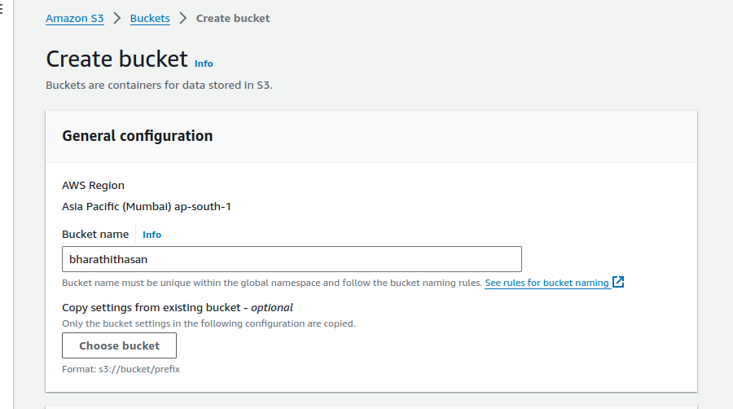
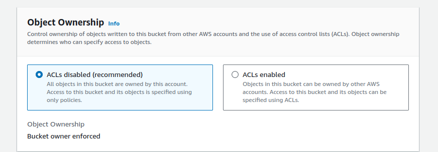
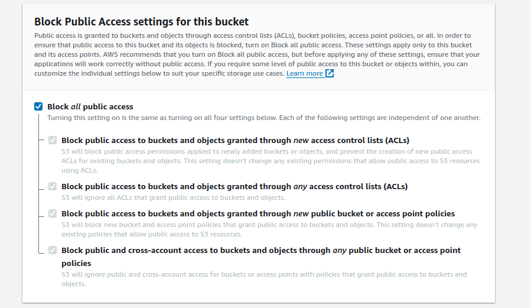
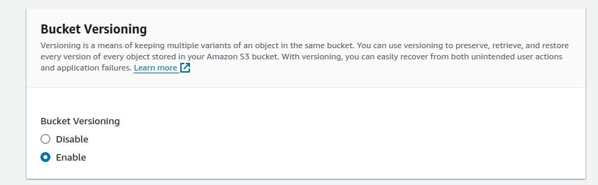

### aws s3 cli command  

# command 1
## aws s3 ls                             >>>  list the all the bucket

# command 2
## aws s3 rm s3://bucket_name/object     >>>  delete the object in s3 bucket 

# command 3
## aws s3 rb s3://bucket_name            >>>  delete the empty s3 bucket

# command 4 
## aws s3 mb s3://bucket_name --region ap-south-1  >>> create a new s3 bucket

## s3 bucket documentation  
# bucket name 

# bucket ownership 

# block public access

# bucket versioning

