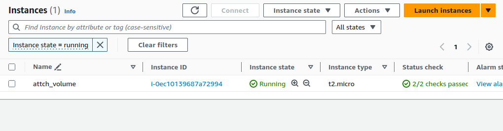
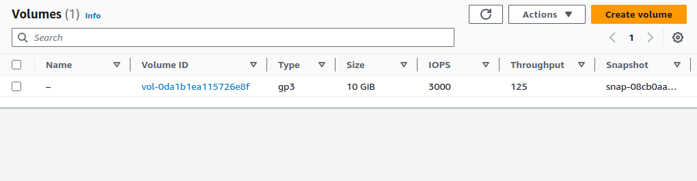
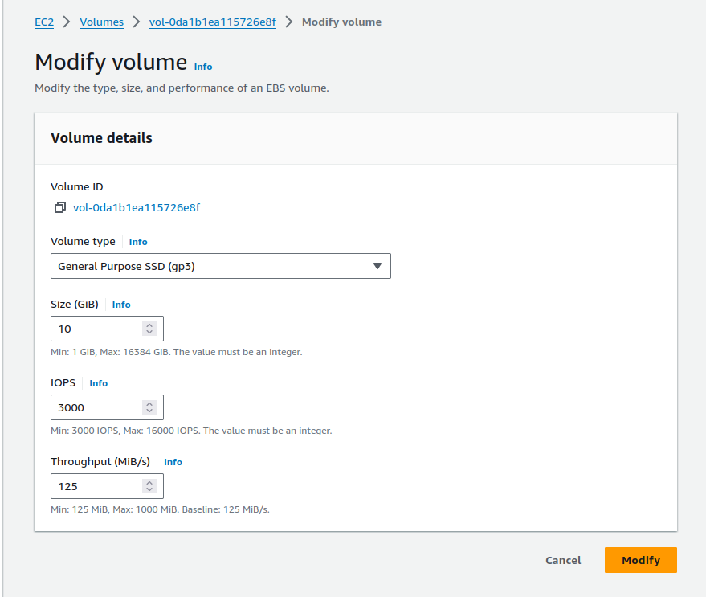
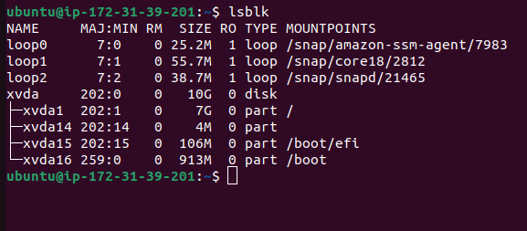
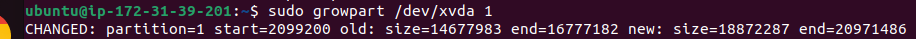
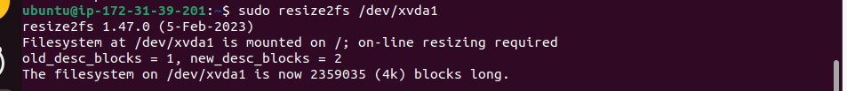
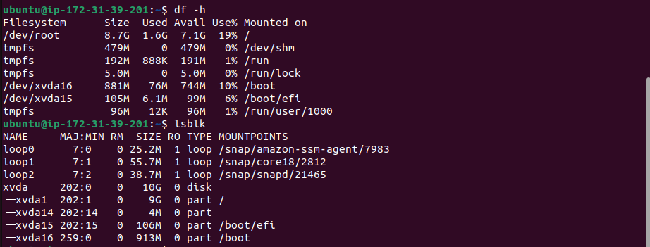

### How attach extend the volume in ec2 linux
## create a ec2 instance 

## once ec2 has been created aws ebs volume will automatically create a volume

## modify the volume size 8gb to 10gb and click modify button 
## 

## connect with your linux server via ssh
## step 1 run this below command verify the disk 
### command lsblk

## step 2  use below command  growpart: Expands the partition to use the new disk space.

### command  sudo growpart /dev/xvda 1

## step 3 use below command resize2fs: Resizes the filesystem within the partition to use the expanded space.
### command sudo resize2fs /dev/xvda1

## step 4 use below command to verify the volume
### command df -h  or lsblk 

